# Marcel

I build small games and desktop tools. My recent work uses Python, Pygame and Swift.

## Projects

- [Risz Engine](https://github.com/marcelzizupl-create/Risz_Engine) — a Pygame engine for small grand strategy games.
- [Touch Bar Burn-In Test](https://github.com/marcelzizupl-create/touchbarapp) — a macOS app for inspecting a physical Touch Bar.

## Commit calendar

## GitHub overview

## Languages

## WakaTime

## Repository traffic

## Steam

GitHub and WakaTime stats: [lowlighter/metrics](https://github.com/lowlighter/metrics). Steam data: Steam Web API. Updated daily.
